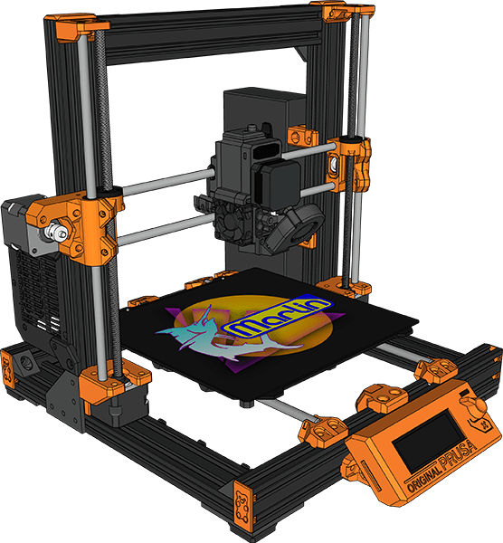

<h1 align="center">Prusa All-in-One Marlin Firmware</h1>

All-in-One Marlin firmware for your 32-bit Prusa MK2.5S & MK3S/+ Bear!

    
    
    
    
    
     
    

## Table of Contents

- [Helpful Links](#helpful-links)
- [Configuring Prusa All-in-One Firmware](#configuring-prusa-all-in-one-firmware)
- [Building Prusa All-in-One Firmware](#building-prusa-all-in-one-firmware)
- [Supported Hardware Upgrades](#supported-hardware-upgrades)
- [Changes to Slicer Start G-code](#changes-to-slicer-start-g-code)
- [Upgrade Caveats](#upgrade-caveats)
- [Credits](#credits)
- [License](#license)

## Helpful Links

 - [Prusa AIO Wiki](//github.com/thisiskeithb/PrusaAIO/wiki/) &mdash; Includes wiring information, recommended motherboard & LCD cases, purchase links for supported hardware, and more!
 - [Prusa AIO Discussions](//github.com/thisiskeithb/PrusaAIO/discussions)
 - [Prusa Bear Upgrade Facebook group](//facebook.com/groups/prusabearupgrade/)
 - [Prusa Community Facebook group](//facebook.com/groups/675831176090951/)

 You can also find me on the [MarlinFirmware Discord](//discord.com/servers/marlin-firmware-461605380783472640): [💬 thisiskeithb#4707](//discordapp.com/users/602976310805135370)

## Configuring Prusa All-in-One Firmware

To configure this firmware, enable options in [`Prusa_AIO_Configuration.h`](Marlin/Prusa_AIO_Configuration.h). No other config file editing is required!

## Building Prusa All-in-One Firmware

To build this firmware, you'll need [Visual Studio Code](//code.visualstudio.com/) with [PlatformIO](//docs.platformio.org/en/latest/integration/ide/vscode.html#platformio-ide-for-vscode). Detailed setup instructions can be found in the [Installing Marlin (PlatformIO with VSCode)](//marlinfw.org/docs/basics/install_platformio_vscode.html) guide.

## Supported Hardware Upgrades

In addition to the stock hardware (except the Einsy motherboard & Power Panic), the following upgrades are supported:

- **Motherboards**: BigTreeTech SKR 3.0 & 3.0 EZ, 2.0 with optional flash drive support, 1.4 & 1.4 Turbo, SKR 1.3, BTT002 1.0, SKR Mini E3 V3.x & V2, MKS/Makerbase Robin Nano V3.x & Eagle with optional flash drive support, SGEN_L V2, and Robin E3 & E3D V1.x
- **Drivers**: TMC2130s, TMC2209s, TMC2226s, and TMC5160s
- **Displays**: BigTreeTech dual mode TFT (TFT35, TFT50, TFT70, etc.), WINSTAR OLED-based RepRapDiscount smart controller, and Mini 12864 with NeoPixel RGB backlight (BigTreeTech Mini 12864 V1/V2 and MKS Mini 12864 V3)
- **LDO/Moons Stepper Motors**: Planetary extruder and 0.9° X/Y/E
- **Extruders:**
  - **BearExxa**: [V1](//github.com/gregsaun/bear_extruder_and_x_axis/) and [V2 (Beta)](//github.com/gregsaun/BearExxa-V2)
  - **Bondtech BMG**: Bondtech BMG upgrade kit and printed BMG
  - **SFP**: Gerd Jentz's "Short Filament Path" extruder based on Bondtech BMG with Mosquito hotend
- **Hotends**: E3D Revo Six, E3D Revo Micro, and Slice Engineering Mosquito / Magnum
- **5015 Part Cooling Fans**: 24V Mechatronics B5015E24B-BSR, 24V Delta BFB0524HH, 24V SoundOriginal, 5V LDO DF5015H05S
- **High Temperature Thermistors**: Slice Engineering 450°C and Trianglelab T-D500 (Dyze Design) 500°C
- **Probes**: BLTouch and SuperPINDA
- NeoPixels
- ESP WiFi addon running [ESP3D](//github.com/luc-github/ESP3D)

## Changes to Slicer Start G-code

The `W` in Prusa's `G28 W ; home all without mesh bed level` default G-code does not exist in Marlin and `G80 ; mesh bed leveling` cancels the current motion mode, so no bed leveling will take place. See the [Changes to Start G-code](//github.com/thisiskeithb/PrusaAIO/wiki/Slicer-G%E2%80%90Code-Notes) wiki article for example start G-code scripts from popular slicers for required changes.

## Upgrade Caveats

As noted in the [Supported Hardware Upgrades](#supported-hardware-upgrades) section above, the stock Einsy board & Power Panic are not supported. This firmware is based on Marlin `bugfix-2.1.x` with options specifically tailored to a Prusa MK3S/+ or MK2.5S Bear with various hardware upgrades. You will lose Prusa firmware features like the setup wizards, automatic calibration, etc., but you can now use a variety of 32-bit boards, modern TMC drivers, and a bunch of other hardware by enabling a few config options in [`Prusa_AIO_Configuration.h`](Marlin/Prusa_AIO_Configuration.h).

## Credits & Thanks

If you find this project helpful, please consider donating!

 - Keith Bennett [[thisiskeithb](//github.com/thisiskeithb)], Prusa AIO Creator - [💸 Github Sponsors](//github.com/sponsors/thisiskeithb) / [☕ Ko-fi](//ko-fi.com/thisiskeithb)
 - Chris Warkocki [[codiac2600](//github.com/codiac2600/)], SKR Bear Project
 - Grégoire Saunier [[gregsaun](//github.com/gregsaun)], Prusa Bear Project - [💸 Patreon](//patreon.com/gregsaun)
 - Scott Lahteine [[thinkyhead](//github.com/thinkyhead)], Marlin Maintainer - [💸 Donate](//www.thinkyhead.com/donate-to-marlin)
 - [E3D](https://e3d-online.com/) for providing hotends for testing
 - First layer calibration based on [Prusa's MK3/S/+ "meander" first layer calibration](//github.com/prusa3d/Prusa-Firmware/blob/MK3/Firmware/first_lay_cal.cpp)

## License

Marlin and the Prusa All-in-One Firmware are published under the [GPL license](/LICENSE) because we believe in open development.
